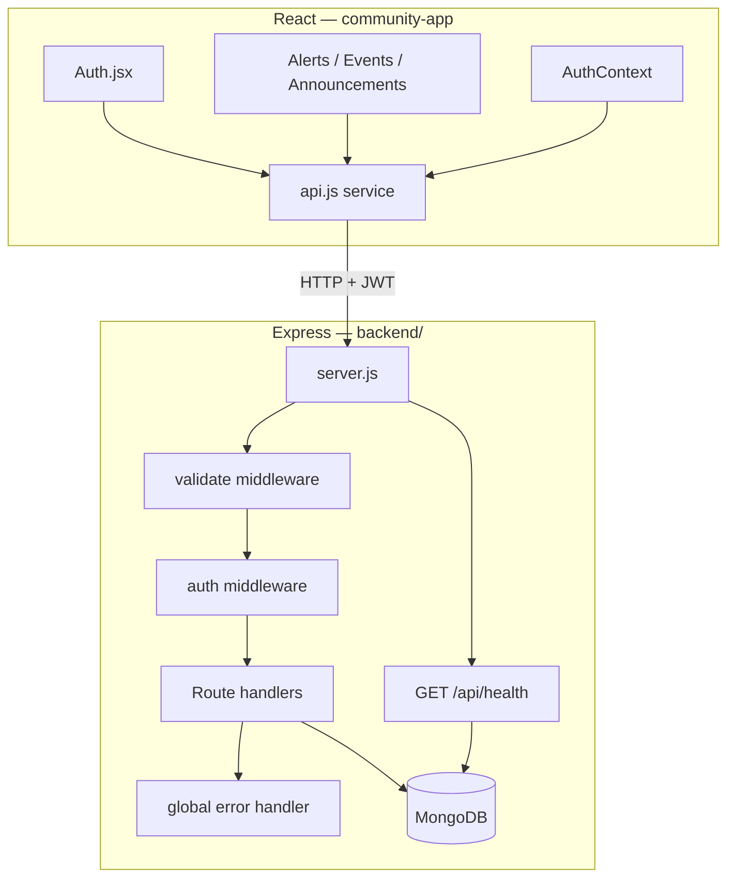

# Design Document — Backend Implementation

## Overview

This document describes the technical design for fully implementing, hardening, and connecting the Airforce Information Portal backend. The Express + MongoDB API is already scaffolded; this work closes the gap between the current scaffold and a production-ready system by addressing environment configuration, admin seeding, input validation, real authentication on the frontend, mock-data removal, security hardening, consistent error handling, update endpoints, health checks, automated tests, and deployment configuration.

The design follows a layered approach: validation middleware sits in front of route handlers, a centralised error handler normalises all error responses, and the frontend API client is the single integration point between React and the Express API.

---

## Architecture



Key design decisions:

- **Validation as middleware** — a reusable `validate(schema)` factory wraps `express-validator` chains so every route declares its own rules without duplicating error-response logic.
- **Centralised error handler** — a single `errorHandler` middleware in `server.js` normalises Mongoose errors (CastError → 400, duplicate key → 409) and unhandled exceptions (→ 500), so route handlers only need to call `next(err)`.
- **No new auth library** — the existing JWT + bcrypt stack is sufficient; the work is wiring the frontend to it and hardening the existing code.
- **In-memory MongoDB for tests** — `mongodb-memory-server` spins up an isolated instance per test run, keeping tests fast and side-effect-free.

---

## Components and Interfaces

### 1. Validation Middleware (`backend/middleware/validate.js`)

A factory function that accepts an array of `express-validator` check chains and returns an Express middleware. If any check fails it responds immediately with HTTP 400 and an array of error messages.

```js
// Usage in a route file
const { body } = require('express-validator');
const validate = require('../middleware/validate');

router.post(
  '/',
  protect,
  adminOnly,
  validate([
    body('title').notEmpty().isLength({ max: 200 }),
    body('severity').isIn(['low', 'medium', 'high', 'warning', 'info'])
  ]),
  createAlert
);
```

### 2. Global Error Handler (`backend/server.js`)

Replaces the current minimal handler. Handles:

| Condition | HTTP | Body |
|---|---|---|
| Mongoose `CastError` | 400 | `{ message: "Invalid ID format" }` |
| Mongoose duplicate key (11000) | 409 | `{ message: "Resource already exists" }` |
| `err.status` set by route | that status | `{ message: err.message }` |
| Everything else | 500 | `{ message: "Internal server error" }` + stack logged |

### 3. Health Endpoint (`GET /api/health`)

Extended to include MongoDB connection state via `mongoose.connection.readyState`.

```js
// readyState: 1 = connected, anything else = disconnected
app.get('/api/health', (req, res) => {
  const dbState = mongoose.connection.readyState === 1;
  res.status(dbState ? 200 : 503).json({
    status: dbState ? 'ok' : 'degraded',
    db: dbState ? 'connected' : 'disconnected',
    timestamp: new Date().toISOString()
  });
});
```

### 4. PUT Endpoints

Added to each resource router with the same `protect → adminOnly → validate → handler` chain as POST. Returns the updated document with `{ new: true }`.

```
PUT /api/alerts/:id
PUT /api/events/:id
PUT /api/announcements/:id
```

### 5. Seed Script (`backend/scripts/seed.js`)

Standalone Node script. Reads `ADMIN_EMAIL` / `ADMIN_PASSWORD` from `process.env` (falling back to CLI args). Connects to MongoDB, upserts the admin user, then exits.

### 6. Frontend — Auth.jsx

`handleLogin` and `handleSignup` are updated to call `authApi.login()` / `authApi.register()` from `api.js`. Demo login buttons remain. Loading state disables the submit button.

### 7. Frontend — Data Pages (Alerts, Events, Announcements)

Mock fallback removed. On API error, an inline error banner is shown instead of silently substituting mock data.

### 8. Frontend — api.js

`update` methods added to each resource API object:

```js
alertsApi.update = (id, data) => request(`/alerts/${id}`, { method: 'PUT', body: JSON.stringify(data) });
```

---

## Data Models

Existing Mongoose schemas are sufficient. The only additions are:

### Validation constraints (enforced at middleware layer, not schema layer)

| Field | Rule |
|---|---|
| `email` | valid email format |
| `password` | min 6 characters |
| `title` | max 200 characters |
| `message` / `content` | max 5000 characters |
| `severity` | enum `['low','medium','high','warning','info']` |
| `priority` | enum `['low','medium','high']` |
| `date` (Event) | parseable ISO 8601 date |

### Environment Variables

| Variable | Purpose |
|---|---|
| `MONGO_URI` | MongoDB connection string |
| `JWT_SECRET` | HMAC secret for JWT signing |
| `JWT_EXPIRES_IN` | Token lifetime (e.g. `7d`) |
| `PORT` | HTTP listen port |
| `CLIENT_URL` | Allowed CORS origin |
| `ADMIN_EMAIL` | Seed script admin email |
| `ADMIN_PASSWORD` | Seed script admin password |

---


## Correctness Properties

*A property is a characteristic or behavior that should hold true across all valid executions of a system — essentially, a formal statement about what the system should do. Properties serve as the bridge between human-readable specifications and machine-verifiable correctness guarantees.*

### Property 1: Invalid email rejected

*For any* string submitted as the `email` field on `POST /api/auth/register` that does not conform to a valid email address format, the API shall return HTTP 400.

**Validates: Requirements 3.1**

---

### Property 2: Short password rejected

*For any* string submitted as the `password` field on `POST /api/auth/register` whose length is less than 6 characters, the API shall return HTTP 400.

**Validates: Requirements 3.2**

---

### Property 3: Invalid enum value rejected

*For any* request to `POST /api/alerts` with a `severity` value not in `["low","medium","high","warning","info"]`, or to `POST /api/announcements` with a `priority` value not in `["low","medium","high"]`, the API shall return HTTP 400.

**Validates: Requirements 3.3, 3.5**

---

### Property 4: Invalid date rejected

*For any* string submitted as the `date` field on `POST /api/events` that cannot be parsed as a valid ISO 8601 date, the API shall return HTTP 400.

**Validates: Requirements 3.4**

---

### Property 5: Field length limit enforced

*For any* request where `title` exceeds 200 characters or `message`/`content` exceeds 5000 characters, the API shall return HTTP 400.

**Validates: Requirements 3.6**

---

### Property 6: Mismatched passwords rejected client-side

*For any* pair of password strings where the two values are not equal, the signup form shall display a validation error and shall not invoke `authApi.register()`.

**Validates: Requirements 4.4**

---

### Property 7: API data replaces mock data

*For any* non-empty array returned by the API for alerts, events, or announcements, the rendered page shall display exactly those items and shall not merge or substitute mock data.

**Validates: Requirements 5.1**

---

### Property 8: CORS rejects foreign origins

*For any* HTTP request whose `Origin` header does not match the value of `CLIENT_URL`, the API shall reject the request and not include an `Access-Control-Allow-Origin` header permitting that origin.

**Validates: Requirements 6.1, 6.2**

---

### Property 9: Rate limiter enforces 100-request cap

*For any* IP address that sends more than 100 requests to `/api/` within a 15-minute window, every request beyond the 100th shall receive HTTP 429.

**Validates: Requirements 6.4, 6.5**

---

### Property 10: All error responses contain a message field

*For any* request that results in an error response (4xx or 5xx), the response body shall be a JSON object containing at minimum a `message` string field.

**Validates: Requirements 7.1**

---

### Property 11: CastError maps to 400

*For any* request that includes an invalid MongoDB ObjectId (e.g., a malformed `:id` path parameter), the API shall return HTTP 400 rather than HTTP 500.

**Validates: Requirements 7.3**

---

### Property 12: Duplicate key maps to 409

*For any* request that would create a document violating a unique index (e.g., registering with an already-used email), the API shall return HTTP 409.

**Validates: Requirements 7.4**

---

### Property 13: Unknown routes return 404

*For any* request path that does not match a registered route, the API shall return HTTP 404 with `{ "message": "Route not found" }`.

**Validates: Requirements 7.5**

---

### Property 14: PUT updates and returns the document

*For any* existing alert, event, or announcement document and any valid partial update payload, a `PUT` request by an authenticated admin shall return HTTP 200 with the updated document reflecting the submitted changes.

**Validates: Requirements 8.1, 8.2, 8.3**

---

### Property 15: PUT on non-existent ID returns 404

*For any* `PUT` request targeting a document ID that does not exist in the database, the API shall return HTTP 404.

**Validates: Requirements 8.4**

---

### Property 16: Protected routes require JWT

*For any* route that requires authentication, a request made without a valid JWT in the `Authorization` header shall receive HTTP 401.

**Validates: Requirements 8.5, 10.4**

---

## Error Handling

All error handling is centralised in a single `errorHandler` middleware registered last in `server.js`. Route handlers call `next(err)` and never write their own 500 responses.

```
Request
  → validate middleware  (400 on bad input)
  → auth middleware      (401 on missing/invalid JWT, 403 on wrong role)
  → route handler        (calls next(err) on unexpected errors)
  → errorHandler         (normalises and responds)
```

**errorHandler logic:**

```js
function errorHandler(err, req, res, next) {
  // Mongoose invalid ObjectId
  if (err.name === 'CastError') {
    return res.status(400).json({ message: 'Invalid ID format' });
  }
  // MongoDB duplicate key
  if (err.code === 11000) {
    return res.status(409).json({ message: 'Resource already exists' });
  }
  // JWT errors
  if (err.name === 'JsonWebTokenError' || err.name === 'TokenExpiredError') {
    return res.status(401).json({ message: 'Not authorized, invalid token' });
  }
  // Explicit status set by route
  const status = err.status || 500;
  if (status === 500) console.error(err.stack);
  res.status(status).json({ message: status === 500 ? 'Internal server error' : err.message });
}
```

**Frontend error handling:**

- `api.js` already throws `new Error(data.message)` on non-ok responses — no change needed.
- Data pages catch the thrown error and set an `error` state string rendered as an inline banner.
- `AuthContext` catches a 401 from `authApi.me()` and calls `authApi.removeToken()`.

---

## Testing Strategy

### Tooling

| Tool | Purpose |
|---|---|
| `jest` | Test runner and assertion library |
| `supertest` | HTTP integration testing against the Express app |
| `mongodb-memory-server` | Isolated in-memory MongoDB per test run |
| `fast-check` | Property-based testing (PBT) library |

Install additions: `npm install --save-dev jest supertest mongodb-memory-server fast-check`

### Dual Testing Approach

**Unit / integration tests** cover specific examples, edge cases, and error conditions:
- Each route's happy path (valid request → expected response)
- Auth middleware (missing token, expired token, wrong role)
- Seed script (creates user, skips duplicate, handles DB error)
- Health endpoint (connected, disconnected)
- Frontend components (Auth form wiring, data page error banner)

**Property-based tests** verify universal properties across generated inputs (minimum 100 iterations each):
- Each of the 16 Correctness Properties above maps to exactly one PBT test.
- `fast-check` arbitraries generate random emails, passwords, enum values, date strings, ObjectIds, and request payloads.

### Test File Layout

```
backend/
  tests/
    setup.js          — mongodb-memory-server lifecycle hooks
    auth.test.js      — auth routes + middleware
    alerts.test.js    — alerts CRUD + PBT for validation/update properties
    events.test.js    — events CRUD + PBT
    announcements.test.js — announcements CRUD + PBT
    health.test.js    — health endpoint
    errorHandler.test.js  — CastError, duplicate key, unknown route
    pbt/
      validation.pbt.test.js  — Properties 1–5 (input validation)
      cors.pbt.test.js        — Property 8 (CORS)
      rateLimit.pbt.test.js   — Property 9 (rate limiter)
      errors.pbt.test.js      — Properties 10–13 (error shape)
      crud.pbt.test.js        — Properties 14–16 (PUT, 404, 401)
```

### Property Test Tag Format

Each property-based test must include a comment tag:

```js
// Feature: backend-implementation, Property 1: Invalid email rejected
fc.assert(fc.property(fc.string().filter(s => !isValidEmail(s)), async (badEmail) => {
  const res = await request(app).post('/api/auth/register').send({ email: badEmail, password: 'validpass' });
  expect(res.status).toBe(400);
  expect(res.body).toHaveProperty('message');
}), { numRuns: 100 });
```

### Unit Test Balance

- Unit tests focus on specific examples (valid login, invalid credentials, admin-only enforcement) and integration points (seed script, AuthContext session restore).
- Property tests handle broad input coverage — avoid duplicating property-test scenarios in unit tests.
- Target: ~20 unit/integration tests + 16 property tests.

### npm Scripts

```json
"scripts": {
  "test": "jest --forceExit --runInBand",
  "seed": "node scripts/seed.js"
}
```

`--runInBand` ensures the in-memory MongoDB server is not shared across parallel workers.
